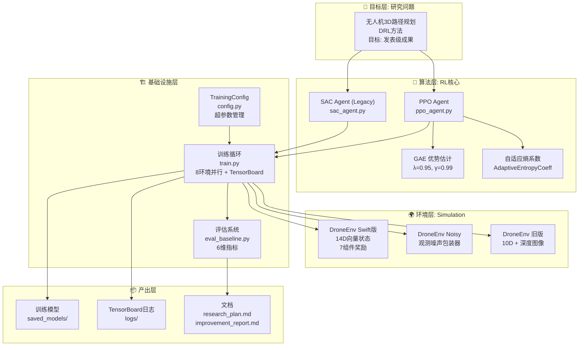
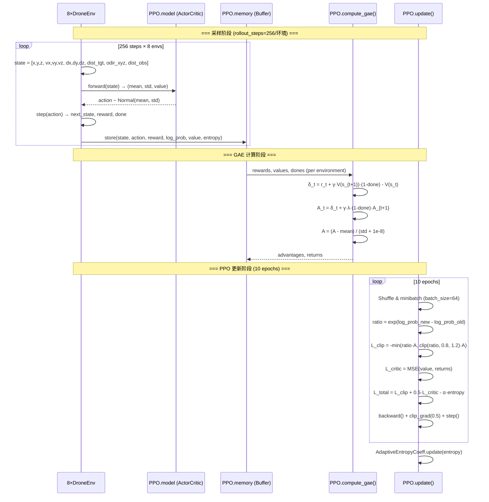
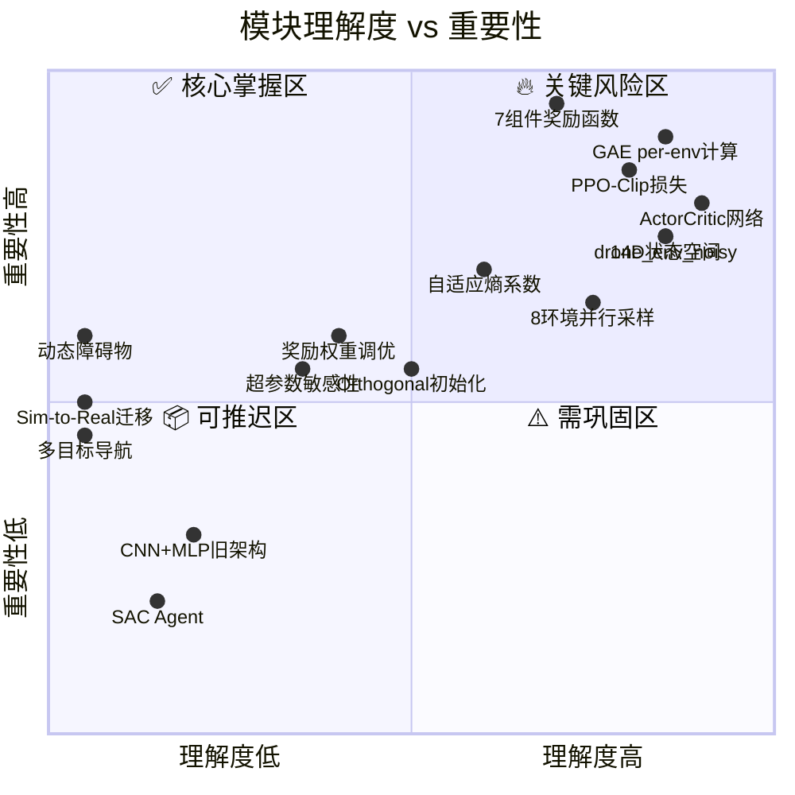
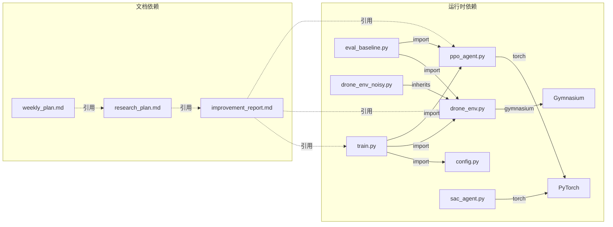

# 🗺️ UAV RL 项目 — 团队认知地图

> **用途**: 团队共用的系统理解地图。每次合并 PR 后同步更新。
> **维护规则**: 谁改了代码，谁更新地图。AI 生成的 PR 也必须附带地图更新。
> **最后更新**: 2026-07-18

---

## 一、系统全景图

---

## 二、数据流：一次 PPO 训练步骤

---

## 三、模块职责矩阵

| 模块 | 文件 | 职责 | 依赖 | 被依赖 |
|------|------|------|------|--------|
| **环境 (Swift)** | `drone_env.py` | 14D状态构建、7组件奖励、物理仿真 | gymnasium, numpy | train.py, eval_baseline.py |
| **环境 (Noisy)** | `drone_env_noisy.py` | 观测噪声包装（继承DroneEnv） | drone_env.py | train.py（可选） |
| **PPO Agent** | `ppo_agent.py` | ActorCritic网络、GAE、PPO更新、自适应熵 | torch, numpy | train.py |
| **SAC Agent (旧)** | `sac_agent.py` | CNN+MLP SAC实现（已弃用） | torch, numpy | 无 |
| **训练循环** | `train.py` | 8环境并行、评估、日志、模型保存 | ppo_agent, drone_env, config | 无 |
| **配置** | `config.py` | 超参数管理、CLI参数解析 | argparse | train.py |
| **评估** | `eval_baseline.py` | 加载模型评估基线性能 | ppo_agent, drone_env | 无 |
| **冒烟测试** | `smoke_test.py` | GAE修复验证 | ppo_agent | 无 |

---

## 四、关键概念速查表

| 概念 | 位置 | 一句话解释 |
|------|------|-----------|
| **14D 状态向量** | `drone_env.py:137-146` | [位置(3), 速度(3), 目标相对位置(3), 目标距离(1), 障碍物方向(3), 障碍物距离(1)] |
| **7组件奖励** | `drone_env.py:251-319` | 距离引导 + 速度方向 + 障碍物惩罚 + 动作平滑 + 到达奖励 + 碰撞惩罚 + 超时惩罚 |
| **GAE (λ=0.95)** | `ppo_agent.py:160-194` | 广义优势估计，平衡偏差-方差。**关键**: per-environment 计算，不可跨环境边界 |
| **PPO-Clip** | `ppo_agent.py:346-349` | `L = -min(ratio·A, clip(ratio, 0.8, 1.2)·A)` |
| **自适应熵系数** | `ppo_agent.py:16-39` | `target_entropy = -action_dim = -3`，动态调整探索强度 |
| **Orthogonal 初始化** | `ppo_agent.py:76-85` | hidden gain=√2, actor output gain=0.01, critic output gain=1.0 |
| **8环境并行** | `train.py:116` | SyncVectorEnv，数据形状: (rollout_steps, num_envs) → 转置为 (num_envs, rollout_steps) 计算 GAE |
| **学习率衰减** | `train.py:204-206` | `lr = 3e-4 × (1 - progress)`，线性衰减至 0 |

---

## 五、🌫️ 理解雾图 (Fog Map)

> 绿色 = 团队理解清晰 | 黄色 = 部分理解 | 红色 = 理解不足 | 灰色 = 未探索

### 当前雾区清单

| 雾区 | 严重度 | 影响 | 解锁方式 |
|------|--------|------|----------|
| Sim-to-Real 迁移 | 🔴 完全未知 | 论文可发表性的关键门槛 | 阅读 Swift 论文章节 4-5，域随机化实验 |
| 动态障碍物 | 🔴 完全未知 | 限制研究深度 | 扩展 drone_env，添加移动障碍物 |
| 超参数敏感性 | 🟡 部分理解 | 调参效率低 | 系统性消融实验 |
| 奖励权重调优 | 🟡 部分理解 | 可能进一步优化 | 基于 reward_components 分析调整权重 |

---

## 六、文件依赖图

---

## 七、团队认知快照

> 每次有人深入理解了一个模块，在这里更新日期和姓名。

| 模块 | 最后深入理解者 | 日期 | 备注 |
|------|---------------|------|------|
| drone_env.py (Swift) | — | 2026-07-12 | 改进报告中详细记录 |
| ppo_agent.py (PPO+GAE) | — | 2026-07-12 | 改进报告中详细记录 |
| train.py (并行训练) | — | 2026-07-12 | 改进报告中详细记录 |
| config.py (超参数) | — | 2026-07-12 | 需系统性消融实验 |
| drone_env_noisy.py | — | 2026-07-19 | 5种噪声模式实现+10K采样验证，分布正确性确认 |
| sac_agent.py (旧版) | — | — | 已弃用 |
| Sim-to-Real | — | — | 待研究 |

---

## 八、地图维护规则

1. **PR 合并前**: 如果代码改动影响了模块职责、数据流或依赖关系，必须更新此地图
2. **新增模块**: 添加到职责矩阵和依赖图
3. **理解度变化**: 有人深入研究某模块后，更新雾图和认知快照
4. **每周 Review**: 团队周会时花 5 分钟确认地图是否反映当前理解状态
5. **AI 生成代码**: PR 描述中必须包含此地图的更新 diff
