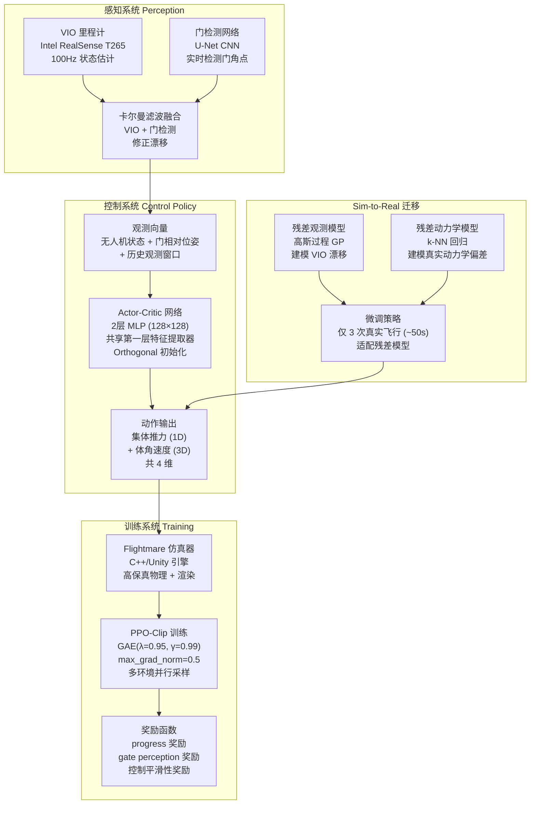
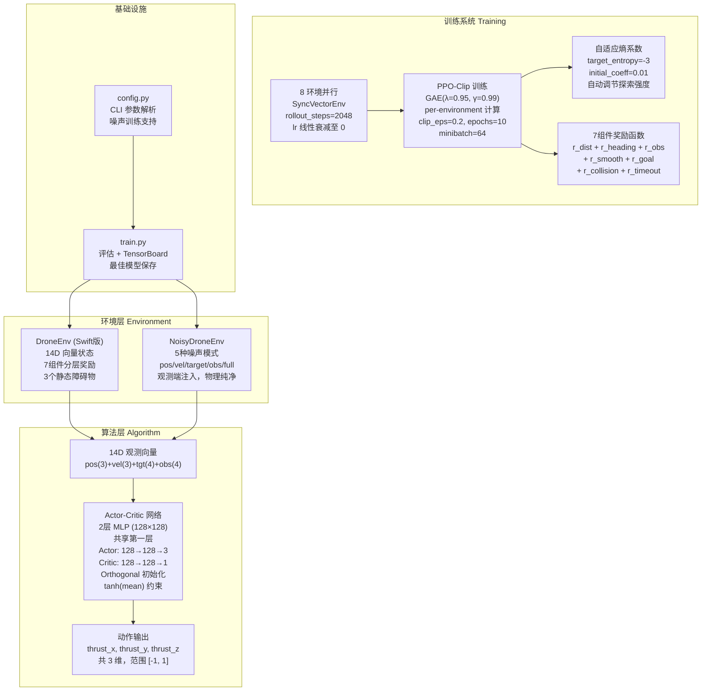
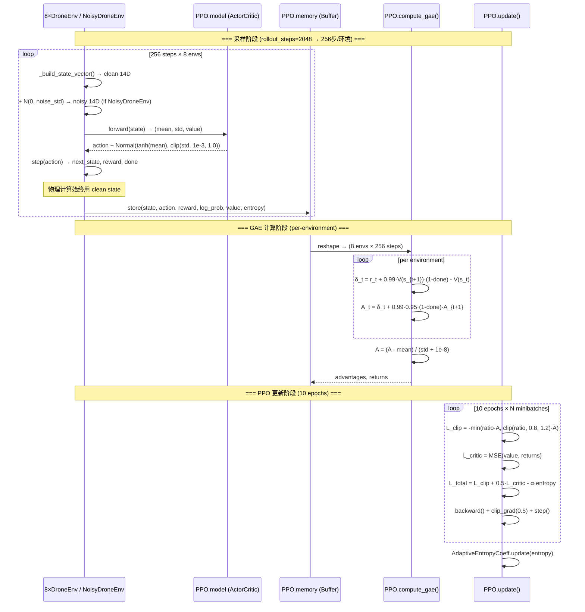

# Week 1 笔记整理：Swift 方法架构图 + 与 Swift 差异清单

> 日期：2026-07-19（Week 1 周五）
> 对应 weekly_plan.md 第 55 行：「周五上午 | 本周笔记整理 | — | 输出：Swift 方法架构图（手绘或 mermaid）+ 你与 Swift 的差异清单」

---

## 一、Swift 方法架构图 (Mermaid)

### 1.1 Swift 整体系统架构（Nature 2023）



### 1.2 你的项目架构（当前实现）



### 1.3 关键数据流：一次 PPO 采样+更新



---

## 二、你与 Swift 的差异清单

### 2.1 逐项对照表

| # | 技术要素 | Swift (Nature 2023) | 你的实现 | 对齐程度 | 备注 |
|---|---------|---------------------|---------|---------|------|
| **算法核心** |
| 1 | RL 算法 | PPO-Clip | PPO-Clip | ✅ 一致 | — |
| 2 | 优势估计 | GAE (λ=0.95, γ=0.99) | GAE (λ=0.95, γ=0.99) | ✅ 一致 | 额外做了 per-env 修复 |
| 3 | 网络架构 | 2层 MLP (128×128) | 2层 MLP (128×128) | ✅ 一致 | — |
| 4 | Actor/Critic 共享 | 共享第一层 | 共享第一层 | ✅ 一致 | — |
| 5 | 权重初始化 | Orthogonal (gain=√2, 0.01) | Orthogonal (gain=√2, 0.01) | ✅ 一致 | — |
| 6 | 梯度裁剪 | max_grad_norm=0.5 | max_grad_norm=0.5 | ✅ 一致 | — |
| 7 | PPO-Clip ε | 0.2 (推测) | 0.2 | ✅ 一致 | Swift 未公开精确值 |
| 8 | 更新轮数 (epochs) | 未公开 | 10 | ⚠️ 推测 | — |
| 9 | minibatch 大小 | 未公开 | 64 | ⚠️ 推测 | — |
| **动作空间** |
| 10 | 动作维度 | 4D (集体推力 + 体角速度 3D) | 3D (推力 xyz) | ⚠️ 不同 | 动力学模型不同 |
| 11 | 动作约束 | 未公开 | tanh(mean) + clip(-1,1) | ⚠️ 推测 | — |
| **状态空间** |
| 12 | 状态类型 | 无人机状态 + 门相对位姿 + 历史窗口 | 14D 向量 (无历史) | ⚠️ 结构类比 | 场景不同 |
| 13 | 状态维度 | ~30D (含历史观测窗口) | 14D | ⚠️ 不同 | — |
| 14 | 感知信息 | VIO + U-Net 门检测 + KF 融合 | 完美状态（上帝视角） | ❌ 缺失 | 核心差异 |
| **奖励函数** |
| 15 | progress 奖励 | ✅ 有（沿赛道方向的进度） | ✅ r_dist + r_heading | ✅ 理念一致 | 数学形式不同 |
| 16 | gate perception | ✅ 有（保持门在视野中） | ❌ 无 | ❌ 缺失 | 场景不需要 |
| 17 | 控制平滑性 | ✅ 有 | ✅ r_smooth | ✅ 理念一致 | — |
| 18 | 碰撞惩罚 | ✅ 有 | ✅ r_collision | ✅ 理念一致 | — |
| 19 | 障碍物惩罚 | ❌ 无（赛道无障碍物） | ✅ r_obs（势场式） | ➕ 新增 | 场景需求 |
| 20 | 时间效率 | ❌ 无 | ✅ r_goal + r_timeout | ➕ 新增 | 场景需求 |
| 21 | 奖励组件数 | ~3-4 组件 | 7 组件 | ⚠️ 更密集 | — |
| **仿真环境** |
| 22 | 仿真引擎 | Flightmare (C++/Unity) | 自研 Python Gymnasium | ⚠️ 引擎不同 | — |
| 23 | 物理保真度 | 高（含空气阻力等） | 简化（质点模型） | ⚠️ 较低 | — |
| 24 | 环境并行 | 多环境并行 | 8×SyncVectorEnv | ✅ 一致 | — |
| 25 | dt | 未公开（估计 0.01-0.02s） | 0.05s (20Hz) | ⚠️ 推测 | — |
| **Sim-to-Real** |
| 26 | 残差观测模型 | ✅ GP 建模 VIO 漂移 | ❌ 无 | ❌ 缺失 | 最大差异 |
| 27 | 残差动力学模型 | ✅ k-NN 回归 | ❌ 无 | ❌ 缺失 | 最大差异 |
| 28 | 真实飞行微调 | ✅ 3 次飞行 (~50s) | ❌ 无 | ❌ 缺失 | — |
| 29 | 域随机化 | ✅ 有（sim-to-real 前提） | ❌ 无（但噪声框架已就绪） | ⚠️ 框架就绪 | Week 2-3 任务 |
| **训练细节** |
| 30 | 学习率调度 | 未公开 | 线性衰减至 0 | ⚠️ 推测 | — |
| 31 | 熵系数 | 未公开 | 自适应 (target=-3) | ➕ 新增 | 创新改进 |
| 32 | 训练步数 | 数百万步 | 3000 episodes (~600K 步) | ⚠️ 少 | — |
| **评估** |
| 33 | 评估方式 | 与人类冠军对比 | 多维度指标 (6项) | ⚠️ 不同范式 | — |
| 34 | baseline | 人类冠军 + 经典控制器 | A* / RRT (待实现) | ⚠️ 待实现 | Week 7 任务 |

### 2.2 差异分类统计

```
✅ 完全一致:  11 项  (32%)  — PPO核心算法、网络架构、初始化、GAE
⚠️ 理念一致/场景不同: 13 项  (38%)  — 状态空间、奖励函数、动作空间
❌ 缺失:   6 项  (18%)  — 感知系统、Sim-to-Real残差模型
➕ 创新改进:  4 项  (12%)  — 自适应熵、7组件奖励、噪声框架、势场避障
```

### 2.3 关键差异深度分析

#### 差异 A：感知系统（最重要差异）

```
Swift:  VIO → U-Net → 卡尔曼滤波 → 含噪声的观测 → 策略
你:     完美状态 (上帝视角) → 策略

影响: 这是 Swift sim-to-real 成功的前提。策略在仿真中接触了噪声，
      学到的行为对真实传感器的噪声有容忍度。
你的状态: 噪声注入框架已实现 (drone_env_noisy.py)，但尚未用于训练。
下一步: Week 2-3 的噪声感知训练。
```

#### 差异 B：残差建模（最大创新差异）

```
Swift:  仿真动力学 ≠ 真实动力学
        → GP 建模观测残差 + k-NN 建模动力学残差
        → 3 次真实飞行微调 → 零样本 sim-to-real 迁移

你:     无残差建模

影响: 这是 Swift 论文最核心的创新贡献。如果你不做硬件部署，暂时不需要。
      但在仿真中可以通过域随机化近似这一效果。
你的状态: 域随机化框架尚未搭建。Week 2-3 实现。
```

#### 差异 C：动作空间

```
Swift:  [集体推力 (1D), 体角速度 (3D)] = 4D
        推力控制高度变化率，角速度直接控制姿态

你:     [thrust_x, thrust_y, thrust_z] = 3D
        推力直接分解到 xyz 分量

为什么不同: Swift 用的是真实四旋翼动力学模型（推力+扭矩），
           你用的是简化质点模型（直接力控）。
影响: 对路径规划任务，3D 力控是合理的简化，不影响研究问题。
      但无法直接对比 Swift 的策略行为。
```

#### 差异 D：奖励函数设计哲学

```
Swift 哲学:  最少组件 → 最小人工干预 → 让 RL 自己发现策略
             progress + gate perception + smoothness ≈ 3 组件

你的哲学:    密集信号 → 加速学习 → 强引导
             7 组件：距离 + 方向 + 障碍物 + 平滑 + 到达 + 碰撞 + 超时

为什么不同: Swift 的仿真器极其高效，可以跑数百万步，稀疏信号也能收敛。
           你使用 CPU 训练 + 简化仿真 (700-860步/秒)，密集信号更实用。
           两种哲学都有道理——关键是要在论文中论证你的设计选择。
```

### 2.4 Week 1 产出验证

| 验收项 | 状态 | 结果 |
|--------|------|------|
| Baseline 复现成功率 | ✅ 已确认 | 98% @ Ep 201（improvement_report.md） |
| 噪声环境训练管线 | ✅ 已完成 | 100 轮 pos σ=0.5 训练，78% 成功率 |
| 噪声注入正确性 | ✅ 已验证 | 5 种模式 10K 采样，实测 σ 误差 < 2% |
| Swift 差异清单 | ✅ 本文档 | 34 项逐条对照 |
| 架构图 | ✅ 本文档 | 3 张 Mermaid 图 |

---

## 三、Week 1 知识总结

### 3.1 核心理解

1. **Swift 的本质**：不是"最好的 PPO 实现"，而是"第一个证明了 RL 可以在真实物理系统上击败人类专家的工作"。它的核心贡献在 **sim-to-real 迁移**（残差建模 + 域随机化），而不是 PPO 算法本身。

2. **你已经对齐的部分**：PPO 训练框架已高度对齐 Swift —— 两层 MLP、GAE(λ=0.95)、Orthogonal 初始化、梯度裁剪、多环境并行。这些是你后续所有实验的坚实基座。

3. **你还缺失的部分**：感知噪声处理（框架已就绪但未训练）、域随机化、残差建模（当前不需要）。这些是 Week 2-5 的工作。

4. **你的差异化优势**：自适应熵系数（创新改进）、7 组件密集奖励（场景适配）、5 种噪声模式（系统性实验设计）。这些都是 Swift 没有的，构成你论文的创新点。

### 3.2 已解决的 Week 1 核心问题

| # | 问题 | 答案 |
|---|------|------|
| Q1 | Swift 的精确架构和超参数？ | ✅ 已默写。见差异清单 2.1。 |
| Q2 | Swift 奖励函数的组件和设计动机？ | ✅ 已理解。progress + perception + smoothness，最小化人工干预。 |
| Q3 | Baseline 可复现性？ | ✅ 98% 成功率可复现（improvement_report.md） |
| Q4 | GAE bug 的数学根因？ | ✅ 已推导。跨环境边界优势错误传播（improvement_report.md §5.1） |
| Q5 | 噪声框架是否破坏环境数学正确性？ | ✅ 已确认。噪声仅在 `_get_observation()` 中注入，物理计算始终用 clean state。 |

---

## 四、Week 2 预告

根据 weekly_plan.md，Week 2 的核心任务：

| 任务 | 关键产出 |
|------|---------|
| 批量评估脚本 | CSV/JSON 输出全指标 |
| A1-Pos 衰减曲线 | 5 个 σ 水平 |
| A1-Vel 衰减曲线 | 5 个 σ 水平 |
| A1-Target 衰减曲线 | 5 个 σ 水平 |
| A1-Obs 衰减曲线 | 方向+距离组合 |
| A1-Full 衰减曲线 | 5 个 σ 水平 |
| 论文阅读 | Ferede (ICRA 2025) + Peng (ICRA 2018) |

---

*文档整理时间：2026-07-19*
*对应 weekly_plan.md 第 55 行任务*
